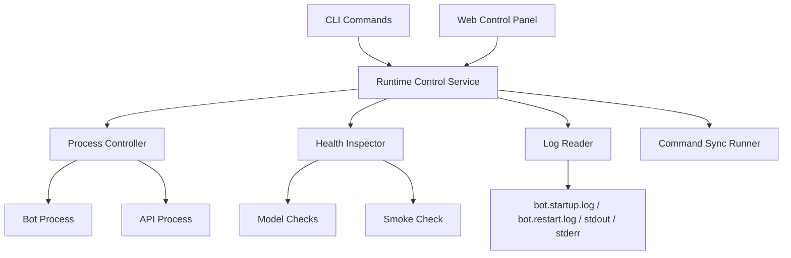

# Runtime Control Panel Design

Date: 2026-03-28
Primary Track: Track E - 运行控制与运维面板层
Secondary Impact: Track C - Discord 交互层

## Overview

This spec defines the first operable runtime control panel for the project. The panel exists to solve one concrete problem: after edits, the operator should be able to tell whether the bot, API, model checks, and Discord sync are healthy without guessing from Discord behavior.

The first version is intentionally an operations console, not a game master panel. It should expose the health and lifecycle of the local runtime, centralize restart/start/stop actions, and show enough log context to explain common failure states such as "READY never appeared", "sync failed", or "process died after startup".

The design follows a two-surface approach:

- a local web panel as the primary operator interface
- a CLI surface as the fallback and scripting entry point

Both surfaces must consume the same runtime control service so later UI expansion does not fork the operational logic.

## Goals

- Provide one local place to see whether bot, API, router model, narrator model, sync, and smoke-check are healthy.
- Provide one local place to start, stop, and restart bot/API/system.
- Reuse existing `smoke-check` and `restart-system` behavior instead of duplicating orchestration logic.
- Preserve a clean boundary so a richer future web UI can be built without replacing process-control internals.

## Non-Goals

- This panel is not a Discord game control surface.
- This panel does not run end-to-end Discord interaction tests.
- This panel does not stream full live logs in real time for the first version.
- This panel does not introduce multi-instance management.
- This panel does not change module, archive, or narration truth contracts.

## User Story

After editing code, the operator opens the local control panel, clicks "Restart System", and then sees whether:

- smoke-check passed
- bot launched
- API launched
- model checks passed
- Discord command sync completed
- `READY` was observed
- the process is still alive after bootstrap

If the system is not healthy, the panel should show the last known failure summary and recent log excerpts instead of silently leaving the operator to test inside Discord.

## Architecture

The runtime control panel is built around a new shared service layer.

## Core Components

### Runtime Control Service

This is the single orchestration boundary for runtime operations. It owns state aggregation and action execution. All new CLI commands and the web panel must call into this layer rather than shelling out independently.

Responsibilities:

- collect current control state
- expose lifecycle actions
- normalize success and failure summaries
- aggregate process, sync, and model-check information

### Process Controller

This component owns bot/API process lifecycle concerns.

Responsibilities:

- detect running bot/API processes
- start bot/API
- stop bot/API
- restart bot/API/system
- preserve existing detached-process behavior on Windows

It should reuse existing process-kill and bootstrap behavior where possible instead of inventing a second lifecycle path.

### Health Inspector

This component answers "is the system usable right now?"

Responsibilities:

- run router/narrator model availability checks
- surface last smoke-check result
- report Discord bootstrap evidence (`READY`, `SYNC_DONE`)
- summarize whether a process is running but not actually healthy

### Log Reader

This component reads and truncates the existing operational logs into user-readable summaries.

Responsibilities:

- read `bot.startup.log`
- read `bot.restart.log`
- read `bot.stdout.log`
- read `bot.stderr.log`
- provide tail summaries for panel display

### Web Control Panel

This is the primary user-facing operations surface.

First version behavior:

- polls every few seconds for state
- exposes buttons for runtime actions
- shows recent status and log summaries
- does not use WebSocket/SSE yet

## State Model

The runtime control service should expose a single state payload shaped around these sections.

### BotStatus

- `running`
- `pid`
- `ready_seen`
- `sync_seen`
- `last_ready_line`
- `last_sync_line`
- `last_error_excerpt`
- `startup_log_path`

### ApiStatus

- `running`
- `pid`
- `reachable`
- `last_error_excerpt`

### ModelStatus

- `router_model`
- `router_available`
- `narrator_model`
- `narrator_available`
- `last_checked_at`

### SmokeCheckStatus

- `last_run_at`
- `passed`
- `summary`

### ControlLogs

- `startup_tail`
- `restart_tail`
- `stdout_tail`
- `stderr_tail`

### ControlState

- `bot`
- `api`
- `models`
- `smoke_check`
- `logs`
- `overall_health`

`overall_health` should remain conservative. A running bot with no `READY` marker should not be reported as healthy.

## Action Model

The following actions form the first stable control surface:

- `start_bot`
- `restart_bot`
- `stop_bot`
- `start_api`
- `restart_api`
- `stop_api`
- `restart_system`
- `sync_commands`
- `run_smoke_check`

Each action result should include:

- `ok`
- `action`
- `summary`
- `details`
- `state_snapshot`

This lets both CLI and web panel show action outcomes without custom parsing.

## Web API

The first panel should be backed by a small local API.

Required endpoints:

- `GET /control-panel/state`
- `POST /control-panel/actions/start-bot`
- `POST /control-panel/actions/restart-bot`
- `POST /control-panel/actions/stop-bot`
- `POST /control-panel/actions/start-api`
- `POST /control-panel/actions/restart-api`
- `POST /control-panel/actions/stop-api`
- `POST /control-panel/actions/restart-system`
- `POST /control-panel/actions/sync-commands`
- `POST /control-panel/actions/smoke-check`

Responses should be JSON and stable enough for later Activity or richer operator UIs if needed.

## CLI Surface

The first CLI additions should be:

- `uv run python -m dm_bot.main run-control-panel`
- `uv run python -m dm_bot.main control-status`

Existing commands remain valid:

- `uv run python -m dm_bot.main smoke-check`
- `uv run python -m dm_bot.main restart-system`

The CLI should use the same runtime control service rather than separate shell logic.

## First Web Panel Layout

### Section 1: System Overview

Cards for:

- Bot
- API
- Router model
- Narrator model
- Discord sync
- Smoke-check

Each card should show a plain-language status and latest relevant timestamp or marker.

### Section 2: Actions

Buttons for:

- Start Bot
- Restart Bot
- Stop Bot
- Start API
- Restart API
- Stop API
- Restart System
- Sync Commands
- Run Smoke Check

The operator should never need to manually remember the command sequence for common lifecycle tasks.

### Section 3: Recent Results

Show:

- last restart result
- last sync result
- last smoke-check result
- last failure summary

### Section 4: Log Summary

Show truncated tails of:

- `bot.startup.log`
- `bot.restart.log`
- `bot.stdout.log`
- `bot.stderr.log`

## Integration With Existing Runtime

The first implementation should not replace these existing behaviors:

- `run_local_smoke_check(...)`
- `run_restart_system(...)`
- startup marker writing in `DiscordDmBot`

Instead it should wrap and organize them so state can be surfaced consistently to both CLI and web consumers.

## Error Handling

Common failures must be operator-visible:

- smoke-check failed
- bot process died during bootstrap
- sync markers never appeared
- `READY` marker never appeared
- API process not reachable
- router or narrator model unavailable

The panel should show the most likely failure source in plain text instead of merely showing "down".

## Track Ownership

Primary ownership belongs to Track E because this is a new operational layer focused on runtime control and lifecycle management.

Secondary impact exists on Track C because:

- command sync visibility belongs to Discord runtime operations
- startup behavior and smoke-check conventions are shared with Discord delivery

This spec must not mutate:

- module truth contracts
- archive semantics
- narration truth

## Success Criteria

The first version is successful if:

1. After code changes, the operator can use one panel to restart the system and verify actual runtime health.
2. The panel can distinguish "process exists" from "usable runtime is ready".
3. Both CLI and web panel share one control-service backend.
4. Failure cases show enough recent log context that the operator can diagnose the likely cause without guessing in Discord first.
5. Existing `smoke-check` and `restart-system` continue to work.

## Future Extensions

Possible later work, not part of the first implementation:

- SSE/WebSocket live log streaming
- richer process metrics
- Discord interaction probe tests
- GM-facing operational dashboard
- Activity-backed operator UI
